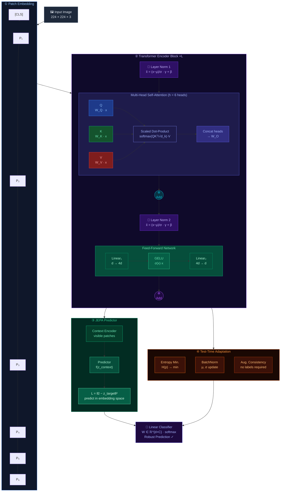

<div align="center">

<h1>🦾 JEPA-RobustViT</h1>

<p><em>Predictive Self-Supervised Vision Transformers under Test-Time Distribution Shifts</em></p>
<p><strong>BSc Computer Science Thesis &nbsp;·&nbsp; Asfand Yar &nbsp;·&nbsp; University of Debrecen &nbsp;·&nbsp; 2026</strong></p>

<!-- Badges Row 1 -->
[](https://python.org)
[](https://pytorch.org)
[](https://github.com/huggingface/pytorch-image-models)
[](LICENSE)

<!-- Badges Row 2 -->
[](https://github.com/asfandyar-prog/JEPA-RobustViT)
[](https://github.com/asfandyar-prog/JEPA-RobustViT)
[](https://github.com/asfandyar-prog)

</div>

---

## 🔍 What is JEPA-RobustViT?

**JEPA-RobustViT** is a research framework combining *predictive self-supervised learning* — inspired by Yann LeCun's Joint-Embedding Predictive Architecture (I-JEPA) — with **test-time adaptation (TTA)** to produce Vision Transformers that stay robust under real-world distribution shifts.

Standard supervised ViTs degrade significantly on corrupted inputs. This work investigates whether learning to **predict representations in embedding space** (not pixels) produces features inherently resistant to noise, blur, weather, and domain change — and whether TTA can close the remaining gap at inference time, without any labels.

> *"A model that can predict its own latent future is a model that understands its world."*

---

## 🏗️ Architecture Overview



---

## 📊 Research Contributions

| # | Contribution | Status |
|---|---|---|
| 🔵 | **ViT Baseline** — timm ViT-S/16, pretrained on ImageNet-1K | ✅ Complete |
| 🟣 | **JEPA Predictive Head** — context→target embedding prediction, masked patch strategy | ✅ Complete |
| 🟢 | **TTA: Entropy Minimization** — minimizes prediction entropy at test time | ✅ Complete |
| 🟢 | **TTA: BatchNorm Adaptation** — adapts running statistics to test distribution | ✅ Complete |
| 🟠 | **ImageNet-C Evaluation** — 15 corruption types × 5 severity levels | 🔄 In Progress |
| 🟠 | **ImageNet-R Evaluation** — rendition/style domain shift benchmark | 🔄 In Progress |
| ⚪ | **Medical Domain Transfer** — ChestX-ray14, DermaMNIST loaders | 🔄 In Progress |

---

## 📁 Repository Structure

```
JEPA-RobustViT/
│
├── 📂 src/
│   ├── backbone.py          # ViT encoder (timm wrapper)
│   ├── predictor.py         # JEPA predictive head
│   ├── classifier.py        # Linear probe classifier
│   └── tta.py               # Test-time adaptation modules
│
├── 📂 scripts/
│   ├── train_backbone.py    # Backbone pretraining
│   ├── train_jepa.py        # JEPA objective training
│   ├── test_backbone.py     # Evaluation pipeline
│   └── eval_robustness.py   # ImageNet-C/R benchmarks
│
├── 📂 results/
│   └── baselines.md         # Tracked experiment results
│
├── main.py                  # Entry point
├── pyproject.toml           # Project configuration
└── requirements.txt         # Dependencies
```

---

## 🚀 Quickstart

**Clone & install:**
```bash
git clone https://github.com/asfandyar-prog/JEPA-RobustViT.git
cd JEPA-RobustViT
pip install -r requirements.txt
```

**Or with `uv` (recommended):**
```bash
uv sync
```

**Run baseline evaluation:**
```bash
python scripts/test_backbone.py --model vit_small_patch16_224 --dataset cifar10
```

**Train with JEPA objective:**
```bash
python main.py --mode jepa --backbone vit_small_patch16_224 --epochs 100
```

**Run TTA robustness evaluation:**
```bash
python scripts/eval_robustness.py --tta entropy --dataset imagenet-c --severity 3
```

---

## 🧠 Key Design Decisions

### Why JEPA over MAE?
Masked Autoencoders reconstruct pixels — a task requiring high-frequency detail but not semantic understanding. JEPA predicts **representations**, forcing the model to reason at the level of meaning. This is hypothesized to yield features more invariant to low-level corruptions like noise and blur.

### Why Test-Time Adaptation?
Even robust pretraining cannot anticipate all deployment-time distribution shifts. TTA adapts normalization statistics and reduces prediction entropy on the specific test batch — with **no labels required**.

### Why ViT?
Transformers lack the inductive biases (translation equivariance, locality) of CNNs. This makes them both more sensitive to distribution shift *and* a cleaner testbed for studying what self-supervised objectives contribute to robustness independently of architecture priors.

---

## 📈 Results (Preliminary)

> Full benchmark table in [`results/baselines.md`](results/baselines.md)

| Model | ImageNet-1K (clean) | ImageNet-C (mCE ↓) | Notes |
|---|---|---|---|
| ViT-S/16 Supervised | ~79.8% | ~55.4 | Baseline |
| ViT-S/16 + MAE | ~83.1% | ~49.2 | Pixel reconstruction |
| **ViT-S/16 + JEPA** *(ours)* | 🔄 WIP | 🔄 WIP | Embedding prediction |
| **+ TTA Entropy Min** *(ours)* | 🔄 WIP | 🔄 WIP | Inference-time adapt |

---

## 📚 Theoretical Background

This work sits at the intersection of three active research threads:

**1. Joint-Embedding Predictive Architectures (LeCun, 2022)**
Predict abstract representations of masked/future inputs rather than raw pixels — learning rich semantic features without pixel-level reconstruction.

**2. Vision Transformers under Distribution Shift**
ViTs exhibit different robustness profiles than CNNs ([Bhojanapalli et al., 2021](https://arxiv.org/abs/2104.02821); [Paul & Chen, 2022](https://arxiv.org/abs/2105.07581)) — understanding *why* is a core question this thesis addresses.

**3. Test-Time Adaptation**
TENT ([Wang et al., 2021](https://arxiv.org/abs/2006.10726)) and subsequent TTA methods demonstrate that adapting normalization layers at inference significantly closes the clean→corrupted accuracy gap without labeled test data.

---

## ⚙️ Dependencies

```toml
[dependencies]
torch       = ">=2.0"
torchvision = ">=0.15"
timm        = ">=0.9"
einops      = ">=0.7"
numpy       = ">=1.24"
tqdm        = ">=4.65"
```

---

## 👤 About

<div align="center">

**Asfand Yar** · BSc Computer Science · University of Debrecen, Hungary

*Thesis project 2025–2026 · Specialization: Generative & Agentic AI Systems*

[](https://github.com/asfandyar-prog)
[](https://linkedin.com/in/asfand-yar-3966b8291)
[](mailto:yarasfand886@gmail.com)

<br/>

*If this work is useful to your research, a ⭐ helps the project grow.*

</div>
